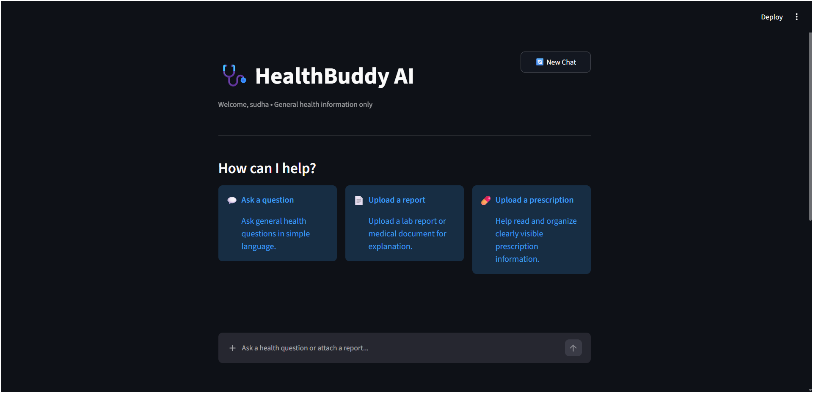
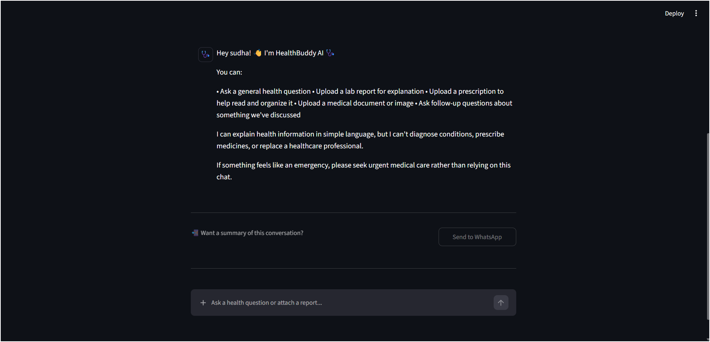
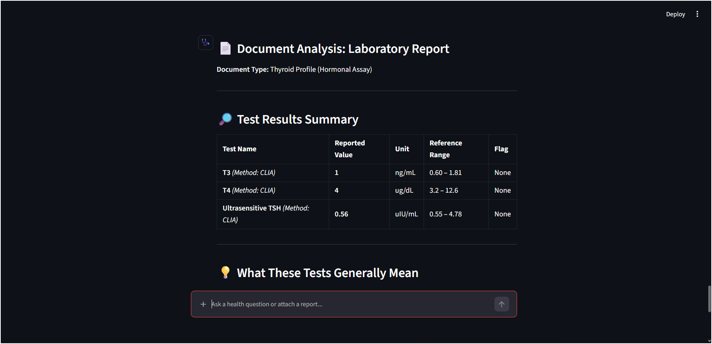
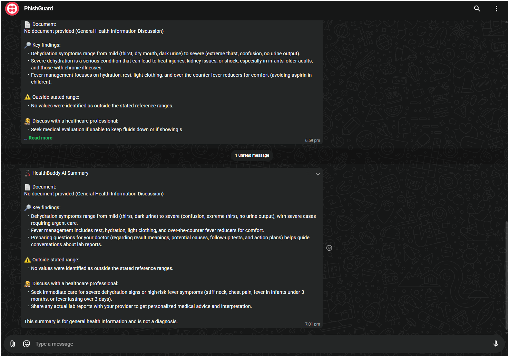
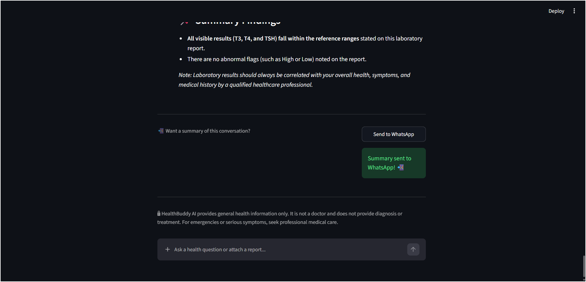

# 🩺 HealthBuddy AI

A Streamlit multimodal health-information assistant powered by Gemini, with optional Twilio WhatsApp summaries.

## ✨ Features

- 💬 Text-based health questions
- 📄 Lab report image/PDF analysis
- 💊 Prescription image/PDF reading and organization
- 🖼️ Medical document and image analysis
- 🧠 Conversation memory using a Gemini chat session
- 🔒 Safety-focused medical prompt
- 📲 WhatsApp summary through Twilio Content API
- ☁️ Streamlit Community Cloud deployment

---

## 📸 Screenshots

### 🏠 Home Page



### 💬 AI Health Chatbot



### 🧪 Lab Report Analysis



### 📲 WhatsApp Summary



### 📱 Send Summary to WhatsApp



---

## 🚀 1. Create the Environment

### Windows PowerShell

```powershell
python -m venv venv
.\venv\Scripts\Activate.ps1